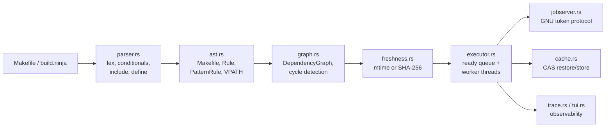

# Inside maked: a make in Rust, a model in Lean, and the benchmark that lied

*Dmytro Yemelianov · October 2026 · [maked v0.2.2](https://github.com/dmytro-yemelianov/maked/releases/tag/v0.2.2)*

maked ("make + ed: Yemelianov (Emelyanov) Dmytro") is a POSIX make (IEEE Std 1003.1) with
the GNU extensions people actually use. It is written in Rust with zero
crates.io dependencies. An executable Lean 4 model of make's rebuild
semantics sits next to it, and a differential fuzzer keeps the three parties
honest: maked, GNU make and the Lean model. This article covers how maked
is put together, what the Lean side does and does not prove, and how it
performs. That includes the part where the first set of benchmark numbers
turned out to be wrong.

## 1. The pipeline

A make implementation is a small compiler followed by a scheduler. maked
keeps the stages separate:



| Module | Lines | Role |
| --- | ---: | --- |
| `parser.rs` | 1,863 | Lexing, recursive (`=`) and simple (`:=`) variables, `ifeq/ifneq/ifdef/ifndef`, `define`, `include`/`-include`, target-specific variables, second expansion, and the common GNU built-in functions (`patsubst`, `filter`, `foreach`, `call`, `eval`, `shell`, `wildcard`, `if`/`and`/`or`, …) |
| `ast.rs` | 348 | `Makefile`, `Rule`, `PatternRule`, `VpathDirective`, `%` pattern matching, `$(MAKE)` bound to the running executable |
| `graph.rs` | 128 | `DependencyGraph` with cycle detection that reports the cycle path |
| `freshness.rs` | 165 | The rebuild decision: POSIX mtime rules or content hashes |
| `executor.rs` | 1,118 | Sequential and parallel schedulers, the shell-bypass fast path, recursive-make plumbing |
| `jobserver.rs` | 317 | GNU make jobserver, both master and client (`--jobserver-auth=fifo:` and fd pairs) |
| `hash.rs` | 284 | A from-scratch FIPS 180-4 SHA-256 and the `.maked.db` build database |
| `cache.rs` | 137 | Content-addressable artifact cache |
| `ninja.rs` | 240 | `--emit-ninja` and a native `build.ninja` reader (`maked -f build.ninja`) |
| `compdb.rs` | 239 | `--emit-compdb`: a Clang `compile_commands.json` derived from the rules |
| `trace.rs` | 247 | `--trace`: a Chrome/Perfetto JSON timeline, plus `--profile` |
| `tui.rs` | 185 | `--tui`: a raw-ANSI live dashboard that falls back to plain output when not on a TTY |
| `distributed.rs` | 567 | `--worker-listen` / `--remote-workers`: an authenticated TCP worker pool with local fallback |

Zero dependencies was a deliberate constraint. SHA-256, the JSON writers and
the terminal renderer are all in-tree. The binary is fully self-contained,
cross-compiles trivially, and its whole supply chain is about 6,000 lines
you can read.

### Freshness: two modes

The default mode follows POSIX. A target is rebuilt when it is missing, when
it is phony, or when any prerequisite is newer than it. One subtle rule is
the *alias* case: a target with no recipe and no file on disk. It inherits
the newest prerequisite time instead of forcing a rebuild. Getting that
wrong makes every `all:` target rebuild forever.

`--hash` swaps timestamps for content. For each target, `.maked.db`
records three things:

- the target's own SHA-256;
- a digest of the expanded recipe;
- the hash of every prerequisite.

So `touch`-ing a file does nothing, and so does a checkout that resets
mtimes. Editing a recipe, however, *does* force a rebuild, which mtime-based
make can never detect.

### Scheduling

The parallel executor computes in-degrees over the dependency graph, seeds a
ready queue with the leaves, and feeds a pool of worker threads over `mpsc`
channels. When a target finishes, its dependents' in-degrees drop, and any
that reach zero join the queue. Before spawning anything, a recipe line is
checked for shell metacharacters. Lines without them are `exec`'d directly,
skipping `/bin/sh -c`. GNU make has the same fast path, and it matters: with
thousands of tiny recipes, process creation dominates.

The jobserver speaks GNU make's token protocol in both directions. maked
can be the master, creating a FIFO and passing `--jobserver-auth` down
through `MAKEFLAGS`. It can also be a client running under GNU make. The
test suite checks both directions and confirms that neither side
oversubscribes.

### The content-addressable cache

With `--cache`, an action's key is

```
SHA-256( target ‖ recipe lines ‖ sorted (prerequisite, SHA-256(content)) )
```

On a hit, the artifact is copied out of `.maked_cache/objects/` and the
recipe never runs. On a miss, the recipe runs and its output is stored. This
is the same idea as Bazel's action cache, at the scale of a single make
invocation. The key only covers what make can see, though. A recipe that
reads an undeclared file, the environment or the clock can be "restored"
into a wrong result. That is an inherent limit of caching make recipes, not
a bug in the hashing.

## 2. The Lean 4 model, and what it is not

`lean_make/` is an executable model of make in Lean 4, with about 1,400
lines across seven modules:

- `Syntax`: rules and targets;
- `Semantics`: rule execution against a filesystem with a logical clock;
- `Graph`: fuel-bounded cycle detection;
- `CriticalPath`: longest weighted path and schedule bounds;
- `Cache`: the CAS model;
- `Scheduling`: `-jN` schedules and how good a greedy scheduler is;
- `Theorems`: the proofs.

There are **58 theorems** (28 of them in `Scheduling`, mostly lemmas about
finite sums), all kernel-checked, with no `sorry` and no `admit`. CI fails
if either word appears, and also if `#print axioms` shows a headline theorem
depending on `sorryAx`. They fall into five groups:

- **Rebuild semantics.** A phony target always rebuilds
  (`phony_always_rebuilds`). A missing target always rebuilds
  (`missing_always_rebuilds`). An up-to-date target needs no rebuild and
  leaves the filesystem and the clock unchanged
  (`executeRule_upToDate_idempotent`, `…_fs_invariant`,
  `…_clock_invariant`). A rebuilt target ends up strictly newer than its
  dependencies (`rebuild_strictly_fresher_than_dep`).
- **Graph and DAG evaluation.** The reported cycle trace starts where it
  should (`cycle_trace_head`). Memoized evaluation of an up-to-date
  subgraph rebuilds nothing (`dag_step_zero_rebuilds`,
  `evalTarget_memoized_upToDate`).
- **Critical path.** Every path's duration is bounded by the computed
  critical path (`pathDuration_le_CP`), and so is the schedule
  (`schedule_bounded_by_path`).
- **Cache.** A store followed by a lookup hits. A cache hit does not run the
  recipe. Running twice is idempotent. Changing the recipe or the
  dependency hashes changes the key.
- **Scheduling with `-jN` slots.** In a discrete-time model, every job
  starts at some `S u` and holds one of `m` slots for its duration. Three
  theorems give bounds:
  - any valid schedule that finishes by `C` has `W ≤ m·C`, where `W` is
    the total work (`work_le_slots_mul_makespan`);
  - no dependency chain finishes faster than the sum of its durations
    (`chain_dur_le_finish`);
  - a greedy schedule, which never leaves a ready job waiting while a slot
    is free, satisfies `m·C ≤ W + (m−1)·L`, that is
    `C ≤ W/m + (1 − 1/m)·L`, where `L` is the critical path
    (`greedy_makespan_bound_tight`: Graham's list-scheduling bound in its
    tight form; the weaker `C ≤ W/m + L` is `greedy_makespan_bound`).

  Together these say that no schedule beats `max(L, W/m)` and that a greedy
  one is within `2 − 1/m` of that. Finding the optimal schedule is NP-hard, so the
  model gives bounds, not an optimal strategy.

Precision matters here, because "formally verified" gets used loosely:

- **The theorems are about the Lean model, not the Rust binary.** Nothing
  is extracted from or to Rust, and there is no refinement proof linking the
  two. What connects them is *testing*: the differential fuzzer below.
- **Some theorems are much shallower than their names suggest.**
  `recipe_tamper_invalidates_key` says that two `CacheKey` structures with
  different command lists are different. That is constructor injectivity.
  The model represents hashes as `Nat`, so collision resistance is assumed
  away, not proven. The model's value is that its definitions are executable
  and precise. It is not a security argument.
- **Cycle detection is fuel-bounded.** It now returns an explicit
  `fuelExhausted` result instead of silently answering "acyclic", which is
  what an earlier version did.

### Using the bounds: `--profile`

`maked --profile` measures each run against those bounds. It takes rule
durations from the trace, timed only once a job holds a jobserver slot, so
waiting for a slot is not counted as work. Here is Lua 5.4.9 built directly
in `src/` (all compiles visible to one scheduler) on the M5:

| `-j` | Total work | Measured span | Lower bound | Greedy bound (tight) | Gap to optimum |
| ---: | ---: | ---: | ---: | ---: | ---: |
| 2 | 3,694 ms | 1,867 ms | 1,847 ms | 2,040 ms | ≤ 1.01× |
| 4 | 4,123 ms | 1,135 ms | 1,031 ms | 1,353 ms | ≤ 1.10× |
| 8 | 5,901 ms | 893 ms | 738 ms | 1,300 ms | ≤ 1.21× |

Every run lands inside the greedy bound, as the theorem predicts if the
executor is greedy. The gap column is an upper bound on how much any
reordering could still win, because the lower bound is not always
achievable. It shows little headroom at `-j2` and `-j4`. At `-j8` part of
the 21% is not scheduling at all: total work rises from 3.7 s to 5.9 s
because every compile slows down when more of them share the CPU (the M5
mixes performance and efficiency cores).

Two limits apply. That maked's executor is greedy is an argument about the
Rust code, not a proof: the coordinator hands a ready target to a worker as
soon as one is free. And a recursive `$(MAKE)` appears as a single job whose
time includes the whole sub-make.

### Checking real schedules with the Lean model

The argument above is checked by testing, not taken on trust.
`lean_make --schedule` is an executable checker built from the same
definitions the theorems use. `checkValid_sound` proves that a schedule it
accepts is valid in the model. For this to be cheap, capacity is checked only
at job start times, and the theorem shows that this suffices.
`benchmarks/fuzzer/schedule_fuzz.py` runs on every CI build:

1. It builds 25 random DAGs whose recipes sleep for 10–60 ms, with
   `maked -j2…4 --trace`.
2. It gives each recorded schedule to the Lean checker.
3. It fails unless the schedule is valid (prerequisites first, at most `m`
   jobs at once) and within the tight form of Graham's bound.

`benchmarks/fuzzer/cache_fuzz.py`, also in CI, does the same for the cache
model in `Cache.lean`. On random DAGs whose recipes concatenate their
inputs, it checks:

- after every target is deleted, `--cache` restores all of them without
  running a recipe, byte-identical to the first build;
- after a leaf changes, `--cache` and `--hash` rebuild exactly what GNU make
  rebuilds, with the same contents;
- touching a leaf without changing it makes `--hash` rebuild nothing.

A self-test feeds the checker schedules that break each rule. A deliberately
wrong slot count in the harness gets caught on real runs.

### v0.1.2: longest remaining path first

Before v0.1.2, ready targets went to workers in hash-map order. Now they wait
in a priority queue ordered by *bottom level*: the target's own duration
plus the longest chain of targets that depend on it. Durations come from
`.maked_log`, which maked writes after each build, much like Ninja's
`.ninja_log`. Without history, the hop count stands in. Any order that never
leaves a slot idle while work is ready keeps Graham's bound, so the theorem
still applies.

| Scheduler | Gap to lower bound on the 25 fuzz DAGs: mean | worst |
| --- | ---: | ---: |
| v0.1.1, hash order | 1.07–1.08× | 1.27–1.30× |
| v0.1.2, bottom level first | 1.01–1.02× | 1.06–1.11× |

Ranges are over two runs each, on the same graphs. On Lua at `-j8` there is
no measurable difference: v0.1.1 takes 510 ± 22 ms, v0.1.2 518 ± 42 ms and
GNU make 521 ± 45 ms. That matches the profile above, since Lua's gap came
from contended CPUs, not from job order. Null builds are unchanged: source
files without rules stay out of the analysis, so it runs only when a recipe
needs a worker.

## 3. Testing: differential, not just unit

- **53 Rust tests.** They cover POSIX behavior (`-B`, `-q`, `-t`), VPATH,
  metaprogramming with `eval`/`call` and second expansion, depfiles, the
  jobserver in both directions, the CAS workflow, Ninja round-trips
  (`--emit-ninja` run by real Ninja, and `-f build.ninja` run by maked),
  the compilation database, distributed workers with fallback, and the
  TUI.
- **A three-way differential fuzzer** (`benchmarks/fuzzer/fuzz_runner.py`).
  It generates 50 random DAGs and puts each through four phases: initial
  build, idempotent re-run, an incremental rebuild after modifying a leaf,
  and the `-q` question mode. In every phase it compares the exact set of
  rebuilt targets across maked, GNU make and the Lean model, and any
  disagreement fails CI. The current result is 50/50. That is evidence, not
  proof: it says nothing about Makefiles the generator never produces.

Every push runs all of this on CI: fmt, clippy, tests, `lake build` and the
fuzzer.

## 4. Benchmarks

### The benchmark that lied

The first internal report claimed two things:

- maked null-builds a 10,000-target graph **15× faster than Ninja**;
- maked beats GNU make on Lua.

Both claims came from measurement bugs. The second look found these:

1. **Ninja was timed without its log.** The harness ran maked and GNU make
   in the same directory, then "null-built" with Ninja. Ninja keeps its own
   `.ninja_log` and had never built that tree. Fifteen hyperfine runs with no
   warmup therefore averaged in real rebuilds. The "15×" compared maked
   doing nothing against Ninja doing work.
2. **make was building one file.** In the generated *modular* Makefiles,
   `all:` is the *last* rule. With no goal given, make builds the *first*
   rule: one `.o` file. GNU make and maked were checking a single target
   while Ninja (`default all`) checked 10,000. Here the error happened to
   favor make.

The fixed harness, [`benchmarks/scalability/fair_bench.sh`](../benchmarks/scalability/fair_bench.sh),
works as follows:

- each tool gets its **own copy** of the generated tree;
- every invocation names the goal explicitly (`all`);
- each cold build is preceded by `ninja -t clean`;
- null builds get 3 warmup runs and 20 measured runs with hyperfine (`-N`,
  no shell);
- every result is written to `fair_bench.json`.

### Results (v0.2.0)

Machine: Apple M5 (10 cores), macOS (Darwin 27.2), GNU Make 4.4.1,
Ninja 1.13.2, maked 0.2.0, all at `-j8`. Mean ± σ.

**Null build (everything up to date), milliseconds.** Lower is better.

| Graph | maked | GNU make | Ninja | maked peak RSS |
| --- | ---: | ---: | ---: | ---: |
| modular, 1,000 targets | 11.8 ± 0.3 | 17.4 ± 0.4 | **3.9 ± 0.2** | 7.6 MB |
| modular, 5,000 | 54.6 ± 2.5 | 95.3 ± 3.2 | **17.1 ± 0.7** | 21.7 MB |
| modular, 10,000 | 113.5 ± 3.8 | 201.0 ± 9.8 | **42.9 ± 19.4** | 39.8 MB |
| wide fan-out, 5,000 | 59.5 ± 9.2 | 123.4 ± 31.6 | **22.9 ± 6.9** | 19.9 MB |
| diamond lattice, 2,500 | 13.4 ± 0.5 | 8.0 ± 0.6 | **5.7 ± 0.4** | 9.2 MB |
| deep chain, 2,000 | 12.6 ± 2.2 | 7.2 ± 0.7 | **4.7 ± 0.5** | 8.8 MB |
| Lua 5.4.9 (real project) | 16.0 ± 2.2 | 13.5 ± 0.7 | — | — |

**Cold build, seconds** (5 runs; Lua 3 runs). Every recipe is a `touch`,
except for Lua, which really compiles.

| Graph | maked | GNU make | Ninja |
| --- | ---: | ---: | ---: |
| modular, 1,000 | 0.27 ± 0.12 | **0.23 ± 0.00** | 0.73 ± 0.02 |
| modular, 5,000 | **1.10 ± 0.04** | 1.29 ± 0.05 | 3.76 ± 0.07 |
| modular, 10,000 | **2.25 ± 0.05** | 2.70 ± 0.13 | 8.77 ± 1.37 |
| wide fan-out, 5,000 | **1.18 ± 0.10** | 12.25 ± 0.78 | 4.94 ± 0.77 |
| diamond lattice, 2,500 | **0.50 ± 0.01** | 0.53 ± 0.02 | 1.77 ± 0.06 |
| deep chain, 2,000 | 2.14 ± 0.11 | **2.13 ± 0.03** | 7.85 ± 0.36 |
| Lua 5.4.9, `make macosx` | 0.77 ± 0.09 | **0.64 ± 0.02** | — |

### Reading the numbers

- **Ninja wins every null build.** That is expected, and it is what Ninja
  was built for: a pre-lowered manifest, no variable expansion, no
  implicit-rule search, and a binary log. A make has to re-parse and
  re-evaluate the Makefile on every run.
- **On null builds, maked is 1.5–2.1× faster than GNU make on modular
  and wide graphs.** On diamond and deep graphs it was 1.7× slower in this
  run, 13 against 8 ms and 13 against 7 ms. v0.2.2 brought that down to
  1.1–1.2× (see below).
- **On cold builds, maked now matches or beats GNU make.** It is 15–17%
  faster on modular 5,000 and 10,000, and tied on the diamond and the
  deep chain. Modular 1,000 is within noise (0.27 ± 0.12 against 0.23 s).
  Both makes beat Ninja by 2.5–3.9×, probably because Ninja always runs
  recipes through `/bin/sh -c`. GNU make's 12 s on the wide fan-out graph
  reproduces in every run. I haven't explained it yet, so read it as a
  measured anomaly, not a win.
- **Lua is noisy.** In this run maked took 0.77 s against GNU make's
  0.64 s (3 runs). A separate hyperfine run of 6 full builds gave
  539 ± 51 ms against 540 ± 10 ms. Null builds take about 14 ms for both.

### What v0.1.1 fixed

The v0.1.0 measurements found three real bugs. Each now has a regression
test:

1. **Job slots lost through recursive `$(MAKE)`.** A sub-make gets its
   `-jN` and `--jobserver-auth` through `MAKEFLAGS`, but maked read the job
   count only from argv. Every sub-make therefore ran at `-j1`. Lua's
   `cd src && $(MAKE) macosx` took 2.6 s at `-j8`, exactly as long as at
   `-j1`. The sub-make now inherits the job count, and the shared token pool
   still caps total concurrency. Lua at `-j8`: 2.62 s → 1.07 s, against
   GNU make's 0.98 s in the same run.
2. **O(depth²) critical-path analysis.** After every build, maked computes
   the critical path, and it memoized a full copy of the best path at every
   node. On a 4,000-long chain that cost 345 MB. It now stores only the best
   predecessor per node, iteratively, so cost is O(V + E): 4,000-deep went
   from 345 MB to 14 MB.
3. **Stack overflow on deep graphs.** Cycle checking and sequential
   evaluation recurse once per dependency level, and a 12,000-long chain
   aborted with a stack overflow that GNU make does not have. maked now runs
   on a thread with a 256 MiB reserved stack (virtual memory, committed only
   as used). A 20,000-deep chain is in the test suite.

Two further speedups came from profiling the fixed build:

- **The coordinator settles up-to-date targets itself** instead of sending
  each one to a worker thread and waiting for the reply. On a chain, that
  round trip was most of a null build.
- **No `stat(2)` per prerequisite when no `vpath`/`VPATH` is set.**
  Prerequisite expansion ran a vpath lookup, and so a `stat`, for every
  prerequisite on every rule lookup, several times per node. Without vpath,
  that lookup can only return the name it was given.

Null builds from v0.1.0 to v0.1.1, end to end: the 2,000-long chain went
from 62.6 ms to 9.9 ms, diamond from 37.7 ms to 15.1 ms, and modular 10,000
from 223.6 ms to 97.5 ms.

### v0.2.0: where the remaining time went

The 0.1.x builds were 1.3–1.75× slower than GNU make on cold builds. I
profiled them with `sample` on macOS and `strace -c` on Linux. These were
the causes, in order of size:

1. **PATH lookup on every spawn.** Rust's `Command` searches `PATH` each
   time. 5,000 `touch` calls took 6.6 s by name and 5.0 s by absolute path;
   GNU make took 5.7 s. maked now resolves each program once per `PATH`.
2. **A copy of the environment for every spawn.** Setting `MAKEFLAGS` per
   command made Rust build a new environment block each time (+0.7 s per
   5,000). The exported variables and `MAKEFLAGS` are now set once in the
   process, and children inherit them.
3. **Thread QoS on macOS.** maked runs on a spawned thread, for its large
   stack. That thread starts below the main thread's QoS class, and the
   recipes it spawns inherited this and landed on efficiency cores: 2×
   slower and very noisy (10.2 ± 2.4 s against 7.8 ± 0.5 s). The builder
   and worker threads now take the main thread's class.
4. **`stat` calls.** A git null build made 116,000 `statx` calls against
   GNU make's 16,000. Every header was checked once per object that lists
   it, and implicit-rule search ran again on every lookup. Rule lookups and
   prerequisite mtimes are now cached for the run: 42,000 calls, and
   1.21 s → 0.60 s on Linux.
5. **Parsing.** Variable expansion built a `Vec<char>` for every fragment.
   It now scans bytes and copies the text between references in one slice.
   Simple commands, in recipes and in `$(shell)`, are split into argv the
   way GNU make does, so `$(shell sh -c '...')` starts one shell, not two.
   A bare `:` line runs no process at all.

The per-process cost of a one-line recipe went from 4.4 ms to 1.9 ms (GNU
make: 2.1 ms). A git null build on macOS went from 670 to about 420 ms
(GNU make: 360–400 ms). Its remaining time is mostly waiting for git's
roughly 40 `$(shell)` calls, which GNU make makes too.

### v0.2.2: null builds on deep graphs, and git on Linux

What was left after v0.2.0 was the null build on graphs with little
parallelism, and git's null build on Linux (0.48 s against GNU make's
0.33 s). I profiled with `sample` on macOS and `strace -c` on Linux, and
used a 160,000-node diamond so that per-node costs stood out. The causes:

1. **A copy of the whole makefile for the worker threads.** The parallel
   executor cloned the `Makefile` (every rule and variable) to hand it to
   its threads. They now borrow it through scoped threads.
2. **Copying rules.** Every rule lookup returned a fresh copy of the rule,
   and git's objects carry about 100 prerequisites each. Rules are now
   shared (`Arc`), and the graph is built from the parsed prerequisites
   without a lookup per node.
3. **Quadratic `+=`.** git's `$(eval $(foreach …))` for the Coccinelle
   matrix generates 224,000 lines with about 11,000 `+=` on the same
   variables, and each one copied the whole value. `+=` now appends in place.
4. **Smaller per-node costs.** SipHash on the hot maps (now an Fx-style
   hash), two `stat`s per target (now one, cached), a critical-path
   analysis on null builds where nothing ran, and freeing 100,000 rules
   just before the process exits.
5. **Parser allocations.** Every line was copied before it was read, and
   every prerequisite went through a one-element `Vec`. Lines are now
   borrowed from the file unless they have continuations.

Two of the causes were also compatibility bugs:

- **A rule run twice.** git's `GIT-VERSION-FILE: FORCE` is an included
  makefile, so it is remade first, and maked then remade it again for the
  goals. GNU make treats a target updated while remaking the makefiles as
  done for the rest of the run. maked now does too, and `GIT-VERSION-GEN`
  runs once.
- **Pattern rules and directories.** A pattern without a `/` is matched
  against the file name alone, and the directory goes back in front of each
  prerequisite made from the pattern. With `%.o: src/%.c`, `a/b.o` comes
  from `a/src/b.c`, not `src/a/b.c`, and `e%t` matches `src/eat` with
  `$*` = `src/a`. maked matched the whole path. Its probes for the
  built-in RCS and SCCS rules therefore went to paths like
  `RCS/./.depend/x.o.d`. Fixing this, and not stat'ing a missing file twice
  when there is no vpath, took git's failed `stat` calls from 18,954 to
  10,200.

Null builds after these changes, at `-j8`:

| | maked | GNU make |
| --- | ---: | ---: |
| deep chain, 2,000 (macOS, ms) | 7.8 ± 1.0 | 6.7 ± 0.6 |
| diamond lattice, 2,500 (macOS, ms) | 8.9 ± 0.5 | 8.0 ± 0.5 |
| git 2.46.0 (macOS, ms) | 345 ± 14 | 402 ± 55 |
| git 2.46.0 (Linux x86_64, s, mean of 10) | 0.38 | 0.33 |

The macOS deep and diamond numbers are 100 hyperfine runs each. The git
runs on macOS are 15, and GNU make's were noisy (σ 55 ms). On Linux, git's
null build went from 0.48 to 0.38 s.

## 5. Real projects

Random DAGs exercise scheduling and freshness, but real makefiles exercise
the language. `benchmarks/realworld/run.py` builds zlib, sqlite (autotools),
redis (recursive makefiles), git (one very large GNU makefile), jq
(autotools and libtool) and Lua with maked and with GNU make. It compares the
builds, smoke tests, produced files, null builds and incremental rebuilds.
The first runs failed in almost every project, each time on something the
fuzzer never generates:

- **Parser:** comments after `include`/`endif`, `\#`, tab-indented
  conditionals outside rules, space-indented lines wrongly read as recipes,
  static pattern rules, double-colon rules, order-only prerequisites, globs
  in prerequisite lists, `export`/`unexport`/`override`, computed variable
  names, and rules whose targets expand to nothing.
- **Semantics:**
  - `.DEFAULT` and `.PHONY` targets without rules;
  - `$<` coming from the rule that has the recipe;
  - `$+`, `$?`, `$|` and the `D`/`F` forms of automatic variables;
  - recipe prefixes (`@ - +`) that appear only after expansion;
  - `-n` printing every line and still running `$(MAKE)` lines;
  - several goals sharing a prerequisite, which must run once;
  - exit status 2 on failure.
- **Missing functions:** `findstring`, `wordlist`, `abspath`, `realpath`,
  `origin`, `flavor`, `file`, `intcmp` and `let`.
- **Environment:** recipes ran under the user's login `$SHELL` instead of
  `/bin/sh`; `CC` from the environment lost to the built-in default; the
  built-in C rule ignored `CPPFLAGS`; exported variables never reached
  recipes; shell builtins such as `:` were exec'd as programs; and `-n`,
  `-s` and command-line variables did not reach sub-makes through
  `MAKEFLAGS`.
- **Two that broke incremental builds:**
  1. A recipe that runs but leaves its target untouched, like automake's
     `config.h: stamp-h1`, made every dependent stale. GNU make re-stats the
     target after its recipe, and maked now does the same.
  2. Makefiles that generate their own includes (git's `GIT-VERSION-FILE`)
     need GNU make's "remaking makefiles" rule. Included makefiles that have
     rules are brought up to date first, then maked restarts to read them.
     Without that, git's first build reported an empty version, and every
     null build after it relinked all 166 programs.

Each fix has a differential test that runs the minimal case under both
tools. All six projects now match GNU make on every check.

Timings from one run of the suite at `-j8` on the M5 (single runs, so
treat differences of a few percent as noise):

| Project | maked build | GNU make build | maked null | GNU make null | maked rebuild after touch | GNU make rebuild after touch |
| --- | ---: | ---: | ---: | ---: | ---: | ---: |
| zlib | 0.49 s | 0.49 s | 0.01 s | 0.01 s | 0.41 s | 0.45 s |
| sqlite | 22.11 s | 21.89 s | 0.02 s | 0.02 s | 1.90 s | 1.84 s |
| redis | 10.23 s | 10.38 s | 1.78 s | 1.82 s | 7.40 s | 7.33 s |
| git | 9.82 s | 9.40 s | 0.42 s | 0.38 s | 9.27 s | 9.32 s |
| jq | 4.70 s | 4.67 s | 0.34 s | 0.33 s | 2.11 s | 2.09 s |
| lua | 0.59 s | 0.52 s | 0.03 s | 0.04 s | 0.54 s | 0.55 s |


## 6. Shipping it

CI and releases run on **raps-ci**, a shared self-hosted Linux x86_64 box
(`runs-on: [self-hosted, raps-ci, maked]`). GitHub-hosted macOS and Windows
runners aren't available for this account. So every release target is
**cross-compiled from Linux** by one script,
[`scripts/ci/package.sh`](../scripts/ci/package.sh):

| Target | How it is built |
| --- | --- |
| `x86_64-unknown-linux-gnu`, `aarch64-unknown-linux-gnu` | `cargo-zigbuild` against glibc 2.17 (runs on CentOS 7 and later) |
| `x86_64-unknown-linux-musl`, `aarch64-unknown-linux-musl` | Rust's self-contained `rust-lld`; static binaries |
| `x86_64-pc-windows-gnu` | mingw-w64 |
| `aarch64-apple-darwin`, `x86_64-apple-darwin`, `universal2-apple-darwin` | `cargo-zigbuild` with Zig as the linker |

Until v0.2.2 the Linux archives were musl only, and they were slow: a git
null build took 1.33 s with the v0.2.1 musl binary, against 0.48 s for the
same code linked with glibc. musl's `malloc` is the difference, and maked
allocates a lot while parsing. The glibc builds are now the default
download. The musl ones remain for systems without glibc.

Zig and cargo-zigbuild are installed into the runner's own tool cache, not
system-wide, because other projects share the box. Pushing a `v*` tag builds
all eight targets, writes `SHA256SUMS` and publishes the GitHub Release. The
v0.1.0 binaries were run by hand on macOS arm64 and x86_64, on Linux x86_64,
and on Linux aarch64 (in a container). The Windows binary is
checked under Wine 10 by `scripts/ci/windows-wine-smoke.sh`: recipes through
`cmd.exe` (including builtins like `copy`), a null build, `-k` and `-j4`.
That first run found that simple recipe lines were exec'd directly, which
fails for cmd.exe builtins. On Windows every recipe now goes through the
shell. Wine 8 cannot run any binary built by Rust 1.78 or later, because it
lacks `bcryptprimitives.dll`.

### Why there is no ESP32 build

The crate compiles for `xtensa-esp32-espidf` with one exception:
`AtomicU64`, which xtensa lacks, and that is easy to work around. The real
problem is that ESP-IDF's `std::process::Command` is a stub returning
`Unsupported`. A make whose whole job is spawning recipe shells, on a
platform with no `fork`, no `exec` and no `/bin/sh`, can parse your Makefile
and then do nothing. A `no_std` parser and dependency-graph library for
microcontrollers would be a different product.

## 7. Known gaps

- On graphs with almost no parallelism (diamond, deep chains), null builds
  are still 1.1–1.2× slower than GNU make (about 1 ms on 2,000 nodes).
- A git null build on Linux takes 0.38 s against GNU make's 0.33 s. GNU make
  answers "does this file exist" from a cache of directory listings. maked
  calls `stat`, and still makes about 10,000 failing calls, mostly for the
  built-in RCS and SCCS rules.
- Remote workers authenticate every request with a shared token (since
  v0.1.3: HMAC-SHA256 over a per-connection nonce, loopback by default,
  sandboxed relative paths), but traffic is **not encrypted**. Between
  hosts, use an SSH tunnel or a VPN.
- The jobserver and remote workers are Unix-only. On Windows, recipes run
  via `$SHELL` or `cmd.exe`.
- The macOS binaries are not notarized.
- No refinement proof connects the Lean model and the Rust code. Three
  fuzzers are the bridge: one for rebuild decisions, one for schedules and
  one for `--cache`/`--hash`.
- `.maked_log` is a new file in the build directory. Add it to
  `.gitignore`.
- The approximations listed under *Compatibility* in the README: merged
  double-colon rules, order-only prerequisites, `$(flavor)` and `$(eval)`
  during the build.

The code, the benchmark harness and its raw JSON are all in the repository:
<https://github.com/dmytro-yemelianov/maked>.
