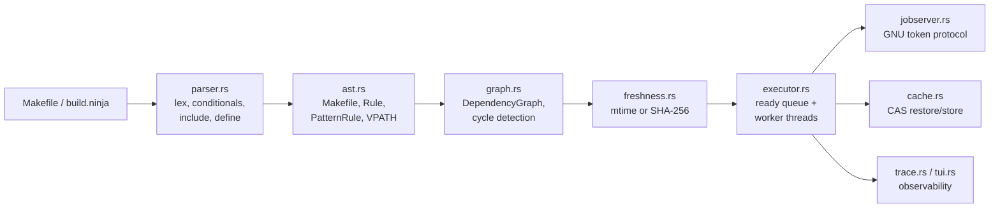

# Inside makeyd: a make in Rust, a model in Lean, and the benchmark that lied

*Dmytro Yemelianov · October 2026 · [makeyd v0.1.1](https://github.com/dmytro-yemelianov/makeyd/releases/tag/v0.1.1)*

makeyd ("make by Yemelianov Dmytro") is a POSIX make (IEEE Std 1003.1) with
the GNU extensions people actually use. It is written in Rust with zero
crates.io dependencies. An executable Lean 4 model of make's rebuild
semantics sits next to it, and a differential fuzzer keeps the three parties
honest: makeyd, GNU make and the Lean model. This article covers how makeyd
is put together, what the Lean side does and does not prove, and how it
performs. That includes the part where the first set of benchmark numbers
turned out to be wrong.

## 1. The pipeline

A make implementation is a small compiler followed by a scheduler. makeyd
keeps the stages separate:



| Module | Lines | Role |
| --- | ---: | --- |
| `parser.rs` | 1,863 | Lexing, recursive (`=`) and simple (`:=`) variables, `ifeq/ifneq/ifdef/ifndef`, `define`, `include`/`-include`, target-specific variables, second expansion, and the common GNU built-in functions (`patsubst`, `filter`, `foreach`, `call`, `eval`, `shell`, `wildcard`, `if`/`and`/`or`, …) |
| `ast.rs` | 348 | `Makefile`, `Rule`, `PatternRule`, `VpathDirective`, `%` pattern matching, `$(MAKE)` bound to the running executable |
| `graph.rs` | 128 | `DependencyGraph` with cycle detection that reports the cycle path |
| `freshness.rs` | 165 | The rebuild decision: POSIX mtime rules or content hashes |
| `executor.rs` | 1,118 | Sequential and parallel schedulers, the shell-bypass fast path, recursive-make plumbing |
| `jobserver.rs` | 317 | GNU make jobserver, both master and client (`--jobserver-auth=fifo:` and fd pairs) |
| `hash.rs` | 284 | A from-scratch FIPS 180-4 SHA-256 and the `.makeyd.db` build database |
| `cache.rs` | 137 | Content-addressable artifact cache |
| `ninja.rs` | 240 | `--emit-ninja` and a native `build.ninja` reader (`makeyd -f build.ninja`) |
| `compdb.rs` | 239 | `--emit-compdb`: a Clang `compile_commands.json` derived from the rules |
| `trace.rs` | 247 | `--trace`: a Chrome/Perfetto JSON timeline, plus `--profile` |
| `tui.rs` | 185 | `--tui`: a raw-ANSI live dashboard that falls back to plain output when not on a TTY |
| `distributed.rs` | 304 | `--worker-listen` / `--remote-workers`: a TCP worker pool with local fallback |

Zero dependencies was a deliberate constraint. SHA-256, the JSON writers and
the terminal renderer are all in-tree. The binary is fully self-contained,
cross-compiles trivially, and its whole supply chain is about 6,000 lines
you can read.

### Freshness: two modes

The default mode follows POSIX. A target is rebuilt when it is missing, when
it is phony, or when any prerequisite is newer than it. One subtle rule is
the *alias* case: a target with no recipe and no file on disk. It inherits
the newest prerequisite time instead of forcing a rebuild. Getting that
wrong makes every `all:` target rebuild forever.

`--hash` swaps timestamps for content. For each target, `.makeyd.db`
records three things:

- the target's own SHA-256;
- a digest of the expanded recipe;
- the hash of every prerequisite.

So `touch`-ing a file does nothing, and so does a checkout that resets
mtimes. Editing a recipe, however, *does* force a rebuild, which mtime-based
make can never detect.

### Scheduling

The parallel executor computes in-degrees over the dependency graph, seeds a
ready queue with the leaves, and feeds a pool of worker threads over `mpsc`
channels. When a target finishes, its dependents' in-degrees drop, and any
that reach zero join the queue. Before spawning anything, a recipe line is
checked for shell metacharacters. Lines without them are `exec`'d directly,
skipping `/bin/sh -c`. GNU make has the same fast path, and it matters: with
thousands of tiny recipes, process creation dominates.

The jobserver speaks GNU make's token protocol in both directions. makeyd
can be the master, creating a FIFO and passing `--jobserver-auth` down
through `MAKEFLAGS`. It can also be a client running under GNU make. The
test suite checks both directions and confirms that neither side
oversubscribes.

### The content-addressable cache

With `--cache`, an action's key is

```
SHA-256( target ‖ recipe lines ‖ sorted (prerequisite, SHA-256(content)) )
```

On a hit, the artifact is copied out of `.makeyd_cache/objects/` and the
recipe never runs. On a miss, the recipe runs and its output is stored. This
is the same idea as Bazel's action cache, at the scale of a single make
invocation. The key only covers what make can see, though. A recipe that
reads an undeclared file, the environment or the clock can be "restored"
into a wrong result. That is an inherent limit of caching make recipes, not
a bug in the hashing.

## 2. The Lean 4 model, and what it is not

`lean_make/` is an executable model of make in Lean 4, with about 1,050
lines across six modules:

- `Syntax`: rules and targets;
- `Semantics`: rule execution against a filesystem with a logical clock;
- `Graph`: fuel-bounded cycle detection;
- `CriticalPath`: longest weighted path and schedule bounds;
- `Cache`: the CAS model;
- `Theorems`: the proofs.

There are **30 theorems**, all kernel-checked, with no `sorry` and no
`admit`. CI fails if either word appears. They fall into four groups:

- **Rebuild semantics.** A phony target always rebuilds
  (`phony_always_rebuilds`). A missing target always rebuilds
  (`missing_always_rebuilds`). An up-to-date target needs no rebuild and
  leaves the filesystem and the clock unchanged
  (`executeRule_upToDate_idempotent`, `…_fs_invariant`,
  `…_clock_invariant`). A rebuilt target ends up strictly newer than its
  dependencies (`rebuild_strictly_fresher_than_dep`).
- **Graph and DAG evaluation.** The reported cycle trace starts where it
  should (`cycle_trace_head`). Memoized evaluation of an up-to-date
  subgraph rebuilds nothing (`dag_step_zero_rebuilds`,
  `evalTarget_memoized_upToDate`).
- **Critical path.** Every path's duration is bounded by the computed
  critical path (`pathDuration_le_CP`), and so is the schedule
  (`schedule_bounded_by_path`).
- **Cache.** A store followed by a lookup hits. A cache hit does not run the
  recipe. Running twice is idempotent. Changing the recipe or the
  dependency hashes changes the key.

Precision matters here, because "formally verified" gets used loosely:

- **The theorems are about the Lean model, not the Rust binary.** Nothing
  is extracted from or to Rust, and there is no refinement proof linking the
  two. What connects them is *testing*: the differential fuzzer below.
- **Some theorems are much shallower than their names suggest.**
  `recipe_tamper_invalidates_key` says that two `CacheKey` structures with
  different command lists are different. That is constructor injectivity.
  The model represents hashes as `Nat`, so collision resistance is assumed
  away, not proven. The model's value is that its definitions are executable
  and precise. It is not a security argument.
- **Cycle detection is fuel-bounded.** It now returns an explicit
  `fuelExhausted` result instead of silently answering "acyclic", which is
  what an earlier version did.

## 3. Testing: differential, not just unit

- **53 Rust tests.** They cover POSIX behavior (`-B`, `-q`, `-t`), VPATH,
  metaprogramming with `eval`/`call` and second expansion, depfiles, the
  jobserver in both directions, the CAS workflow, Ninja round-trips
  (`--emit-ninja` run by real Ninja, and `-f build.ninja` run by makeyd),
  the compilation database, distributed workers with fallback, and the
  TUI.
- **A three-way differential fuzzer** (`benchmarks/fuzzer/fuzz_runner.py`).
  It generates 50 random DAGs and puts each through four phases: initial
  build, idempotent re-run, an incremental rebuild after modifying a leaf,
  and the `-q` question mode. In every phase it compares the exact set of
  rebuilt targets across makeyd, GNU make and the Lean model, and any
  disagreement fails CI. The current result is 50/50. That is evidence, not
  proof: it says nothing about Makefiles the generator never produces.

Every push runs all of this on CI: fmt, clippy, tests, `lake build` and the
fuzzer.

## 4. Benchmarks

### The benchmark that lied

The first internal report claimed two things:

- makeyd null-builds a 10,000-target graph **15× faster than Ninja**;
- makeyd beats GNU make on Lua.

Both claims came from measurement bugs. The second look found these:

1. **Ninja was timed without its log.** The harness ran makeyd and GNU make
   in the same directory, then "null-built" with Ninja. Ninja keeps its own
   `.ninja_log` and had never built that tree. Fifteen hyperfine runs with no
   warmup therefore averaged in real rebuilds. The "15×" compared makeyd
   doing nothing against Ninja doing work.
2. **make was building one file.** In the generated *modular* Makefiles,
   `all:` is the *last* rule. With no goal given, make builds the *first*
   rule: one `.o` file. GNU make and makeyd were checking a single target
   while Ninja (`default all`) checked 10,000. Here the error happened to
   favor make.

The fixed harness, [`benchmarks/scalability/fair_bench.sh`](../benchmarks/scalability/fair_bench.sh),
works as follows:

- each tool gets its **own copy** of the generated tree;
- every invocation names the goal explicitly (`all`);
- each cold build is preceded by `ninja -t clean`;
- null builds get 3 warmup runs and 20 measured runs with hyperfine (`-N`,
  no shell);
- every result is written to `fair_bench.json`.

### Results (v0.1.1)

Machine: Apple M5 (10 cores), macOS (Darwin 27.2), GNU Make 4.4.1,
Ninja 1.13.2, makeyd 0.1.1, all at `-j8`. Mean ± σ.

**Null build (everything up to date), milliseconds.** Lower is better.

| Graph | makeyd | GNU make | Ninja | makeyd peak RSS |
| --- | ---: | ---: | ---: | ---: |
| modular, 1,000 targets | 9.8 ± 0.8 | 18.2 ± 1.3 | **4.2 ± 0.4** | 6.5 MB |
| modular, 5,000 | 43.9 ± 1.7 | 93.2 ± 8.9 | **15.7 ± 1.6** | 17.9 MB |
| modular, 10,000 | 97.5 ± 17.3 | 186.1 ± 8.9 | **29.1 ± 1.3** | 32.9 MB |
| wide fan-out, 5,000 | 71.5 ± 9.8 | 168.3 ± 24.7 | **26.3 ± 3.2** | 16.3 MB |
| diamond lattice, 2,500 | 15.1 ± 0.9 | 7.3 ± 0.6 | **5.2 ± 0.5** | 7.8 MB |
| deep chain, 2,000 | 9.9 ± 0.8 | 5.9 ± 0.4 | **3.9 ± 0.3** | 7.8 MB |
| Lua 5.4.9 (real project) | 24.7 ± 3.2 | 23.7 ± 4.4 | — | — |

**Cold build, seconds** (5 runs; Lua 3 runs). Every recipe is a `touch`,
except for Lua, which really compiles.

| Graph | makeyd | GNU make | Ninja |
| --- | ---: | ---: | ---: |
| modular, 1,000 | 0.44 ± 0.11 | **0.25 ± 0.01** | 0.70 ± 0.02 |
| modular, 5,000 | 1.61 ± 0.04 | **1.21 ± 0.04** | 3.67 ± 0.25 |
| modular, 10,000 | 3.09 ± 0.07 | **2.35 ± 0.05** | 6.98 ± 0.17 |
| wide fan-out, 5,000 | **1.59 ± 0.18** | 20.38 ± 4.53 | 6.47 ± 0.63 |
| diamond lattice, 2,500 | 0.76 ± 0.01 | **0.53 ± 0.03** | 1.78 ± 0.16 |
| deep chain, 2,000 | 3.07 ± 0.06 | **2.02 ± 0.08** | 7.00 ± 0.15 |
| Lua 5.4.9, `make macosx` | 1.07 ± 0.11 | **0.98 ± 0.10** | — |

### Reading the numbers

- **Ninja wins every null build.** That is expected, and it is what Ninja
  was built for: a pre-lowered manifest, no variable expansion, no
  implicit-rule search, and a binary log. A make has to re-parse and
  re-evaluate the Makefile on every run.
- **On null builds, makeyd is 1.8–2.4× faster than GNU make on modular
  and wide graphs, and ties on Lua.** On diamond and deep graphs it is
  still 1.7–2.1× slower, which is 15 against 7 ms and 10 against 6 ms. The
  remaining cost there is coordinating worker threads on graphs with
  almost no parallelism.
- **On cold synthetic builds, GNU make is 1.3–1.75× faster than makeyd,
  and both makes beat Ninja by 2–3.5×.** The likely reason, which I have
  not profiled: both makes `exec` simple recipes directly, while Ninja
  always goes through `/bin/sh -c`. GNU make's 16–20 s on the wide fan-out
  graph reproduces in every run, with high variance. I haven't explained it yet, so read
  it as a measured anomaly, not a win.
- **On Lua, makeyd and GNU make are at parity** for both full and null
  builds.

### What v0.1.1 fixed

The v0.1.0 measurements found three real bugs. Each now has a regression
test:

1. **Job slots lost through recursive `$(MAKE)`.** A sub-make gets its
   `-jN` and `--jobserver-auth` through `MAKEFLAGS`, but makeyd read the job
   count only from argv. Every sub-make therefore ran at `-j1`. Lua's
   `cd src && $(MAKE) macosx` took 2.6 s at `-j8`, exactly as long as at
   `-j1`. The sub-make now inherits the job count, and the shared token pool
   still caps total concurrency. Lua at `-j8`: 2.62 s → 1.07 s, against
   GNU make's 0.98 s in the same run.
2. **O(depth²) critical-path analysis.** After every build, makeyd computes
   the critical path, and it memoized a full copy of the best path at every
   node. On a 4,000-long chain that cost 345 MB. It now stores only the best
   predecessor per node, iteratively, so cost is O(V + E): 4,000-deep went
   from 345 MB to 14 MB.
3. **Stack overflow on deep graphs.** Cycle checking and sequential
   evaluation recurse once per dependency level, and a 12,000-long chain
   aborted with a stack overflow that GNU make does not have. makeyd now runs
   on a thread with a 256 MiB reserved stack (virtual memory, committed only
   as used). A 20,000-deep chain is in the test suite.

Two further speedups came from profiling the fixed build:

- **The coordinator settles up-to-date targets itself** instead of sending
  each one to a worker thread and waiting for the reply. On a chain, that
  round trip was most of a null build.
- **No `stat(2)` per prerequisite when no `vpath`/`VPATH` is set.**
  Prerequisite expansion ran a vpath lookup, and so a `stat`, for every
  prerequisite on every rule lookup, several times per node. Without vpath,
  that lookup can only return the name it was given.

Null builds from v0.1.0 to v0.1.1, end to end: the 2,000-long chain went
from 62.6 ms to 9.9 ms, diamond from 37.7 ms to 15.1 ms, and modular 10,000
from 223.6 ms to 97.5 ms.

## 5. Shipping it

CI and releases run on **raps-ci**, a shared self-hosted Linux x86_64 box
(`runs-on: [self-hosted, raps-ci, makeyd]`). GitHub-hosted macOS and Windows
runners aren't available for this account. So every release target is
**cross-compiled from Linux** by one script,
[`scripts/ci/package.sh`](../scripts/ci/package.sh):

| Target | How it is built |
| --- | --- |
| `x86_64-unknown-linux-musl`, `aarch64-unknown-linux-musl` | Rust's self-contained `rust-lld`; static binaries |
| `x86_64-pc-windows-gnu` | mingw-w64 |
| `aarch64-apple-darwin`, `x86_64-apple-darwin`, `universal2-apple-darwin` | `cargo-zigbuild` with Zig as the linker |

Zig and cargo-zigbuild are installed into the runner's own tool cache, not
system-wide, because other projects share the box. Pushing a `v*` tag builds
all six targets, writes `SHA256SUMS` and publishes the GitHub Release. The
v0.1.0 binaries were run by hand on macOS arm64 and x86_64, on Linux x86_64,
and on Linux aarch64 (in a container). The Windows binary has only been
identified as PE32+, not yet run.

### Why there is no ESP32 build

The crate compiles for `xtensa-esp32-espidf` with one exception:
`AtomicU64`, which xtensa lacks, and that is easy to work around. The real
problem is that ESP-IDF's `std::process::Command` is a stub returning
`Unsupported`. A make whose whole job is spawning recipe shells, on a
platform with no `fork`, no `exec` and no `/bin/sh`, can parse your Makefile
and then do nothing. A `no_std` parser and dependency-graph library for
microcontrollers would be a different product.

## 6. Known gaps

- On graphs with almost no parallelism (diamond, deep chains), null builds
  are still 1.7–2.1× slower than GNU make. Cold synthetic builds are
  1.3–1.75× slower.
- `--worker-listen` runs any command a TCP peer sends, **with no
  authentication or encryption**. Use it only on loopback or a network you
  fully trust.
- The jobserver and remote workers are Unix-only. On Windows, recipes run
  via `$SHELL` or `cmd.exe`.
- Clippy reports about 50 lints. CI shows them but does not yet fail on
  them.
- The macOS binaries are not notarized.
- No refinement proof connects the Lean model and the Rust code. The fuzzer
  is the bridge.

The code, the benchmark harness and its raw JSON are all in the repository:
<https://github.com/dmytro-yemelianov/makeyd>.
